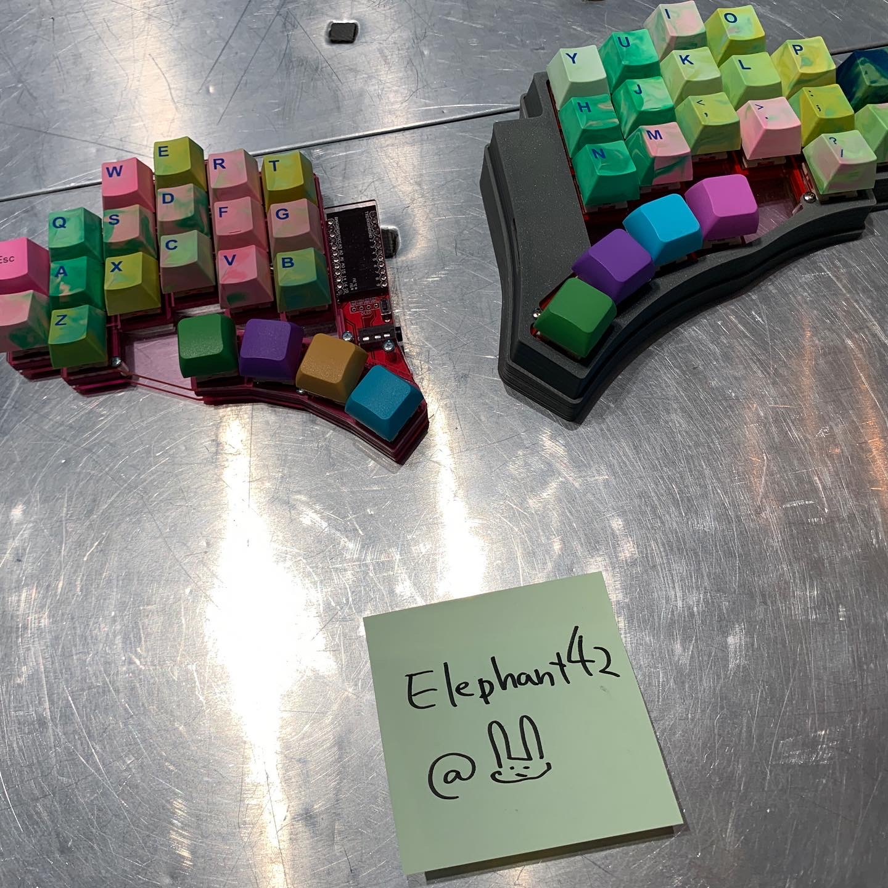
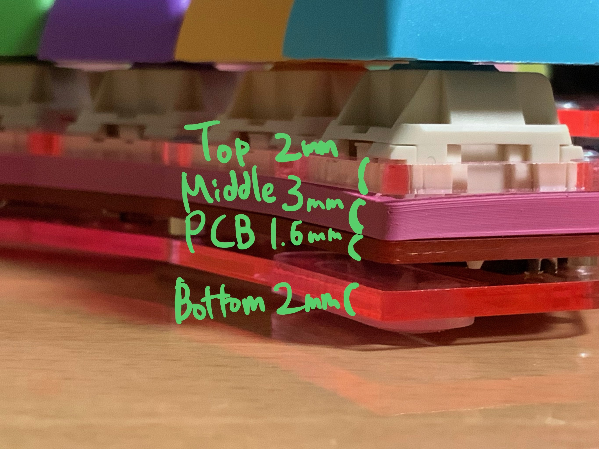

# elephant42 (🐘42)

## plates

|||
|--|--|
|dxf data in plates/|sandwitch mount with 6.5mm spacer|

## pcb

dependency on

  - https://github.com/foostan/kbd/tree/master/kbd.pretty

## cases

currently, not compatible with some switches.

## assembly

- [Build Guide (Japanese)](docs/build-guide.md)
- [Build Guide (English)](docs/build-guide-english.md)

## license?

Beerware!!

Come drink beer in Tokyo with me!! 🍺🍺🍺

## poor english?

Sorry, it's Google Translate.
