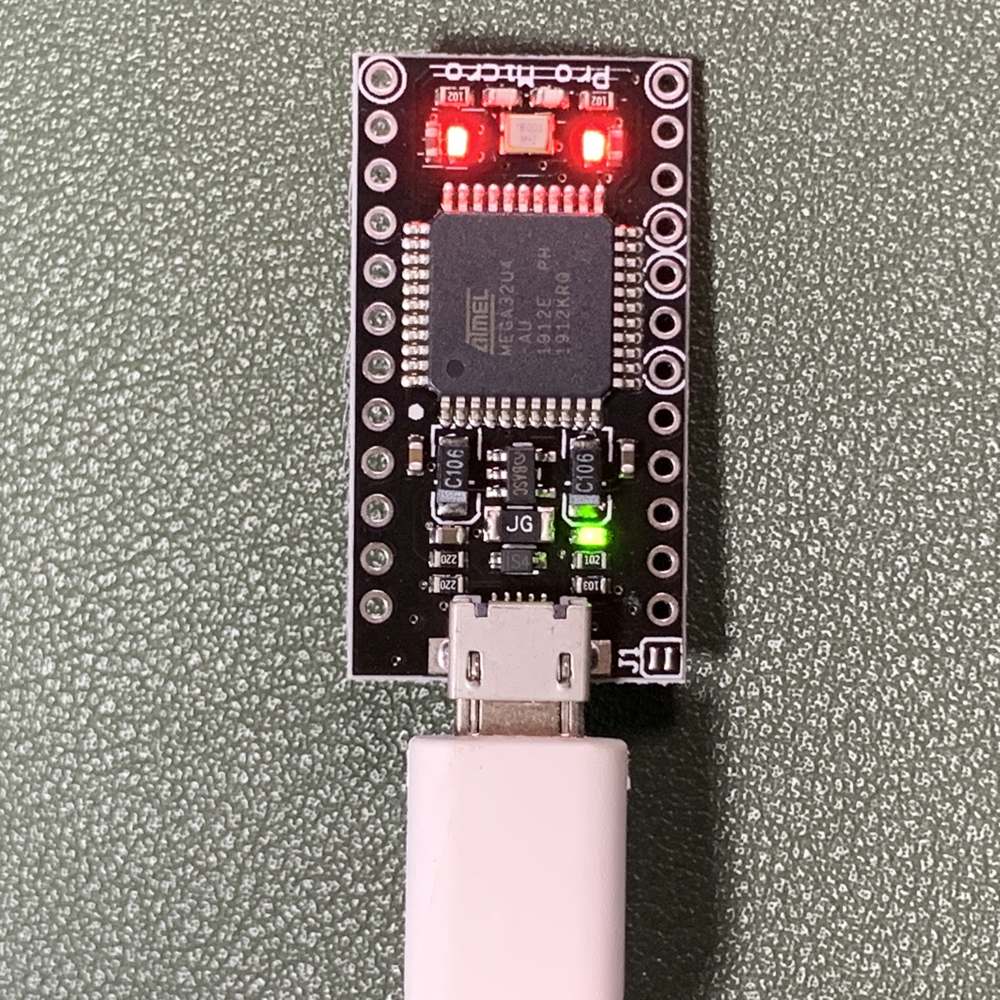
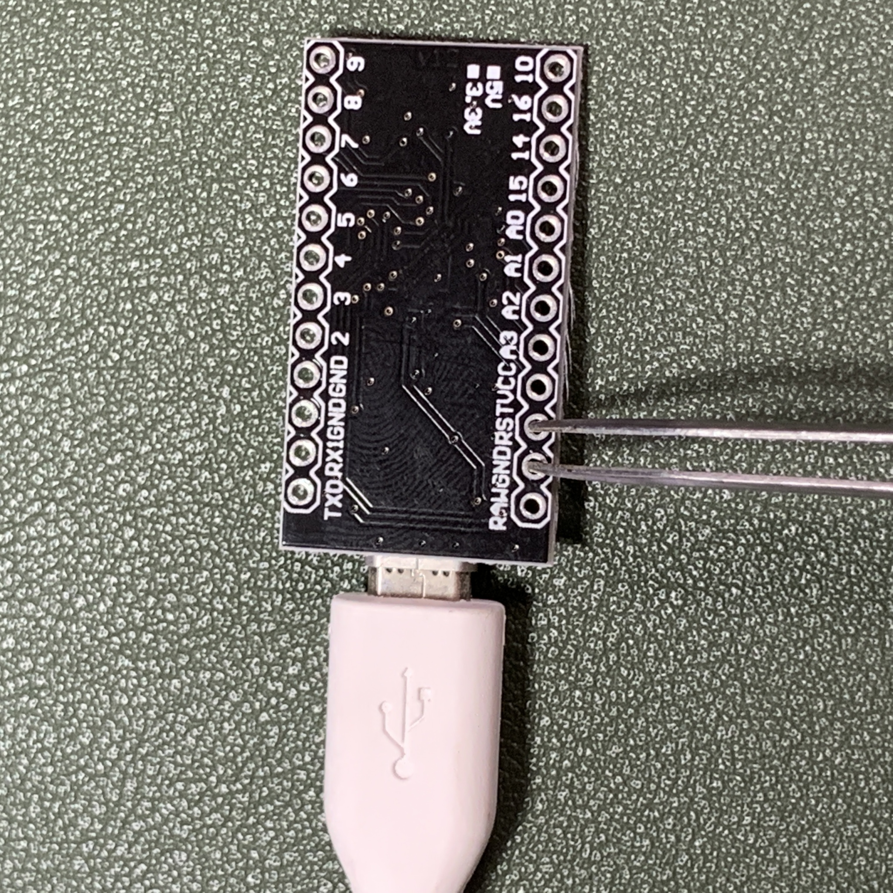

# elephant42 の組み立てかた

自作キーボードキット [elephant42](https://illness072.booth.pm/items/1775017) のビルドガイド(組立説明書)です。

**組み立ての前に、このビルドガイドを先に読んで理解して、材料・工具等を揃え、環境構築をし、最後に実際の組立作業を行ってください。**

**なにか良くわからない、うまくいかないときは、ガッカリしてそこで諦めてしまわずに[私に連絡](https://twitter.com/illness072/)してみてください。できる限り力になる努力をしたいと思います。**

「なにをしようとして」「なにをしたけど」「どうなってしまっているのか」をわかりやすいように質問して頂けるとスムーズです。


<!-- START doctoc generated TOC please keep comment here to allow auto update -->
<!-- DON'T EDIT THIS SECTION, INSTEAD RE-RUN doctoc TO UPDATE -->


- [準備](#%E6%BA%96%E5%82%99)
  - [キット内容の確認](#%E3%82%AD%E3%83%83%E3%83%88%E5%86%85%E5%AE%B9%E3%81%AE%E7%A2%BA%E8%AA%8D)
  - [必要部品の調達](#%E5%BF%85%E8%A6%81%E9%83%A8%E5%93%81%E3%81%AE%E8%AA%BF%E9%81%94)
    - [必須](#%E5%BF%85%E9%A0%88)
    - [オプション](#%E3%82%AA%E3%83%97%E3%82%B7%E3%83%A7%E3%83%B3)
  - [工具の準備](#%E5%B7%A5%E5%85%B7%E3%81%AE%E6%BA%96%E5%82%99)
    - [必要なもの](#%E5%BF%85%E8%A6%81%E3%81%AA%E3%82%82%E3%81%AE)
    - [あると良いもの](#%E3%81%82%E3%82%8B%E3%81%A8%E8%89%AF%E3%81%84%E3%82%82%E3%81%AE)
    - [買い物をする上で参考になるもの](#%E8%B2%B7%E3%81%84%E7%89%A9%E3%82%92%E3%81%99%E3%82%8B%E4%B8%8A%E3%81%A7%E5%8F%82%E8%80%83%E3%81%AB%E3%81%AA%E3%82%8B%E3%82%82%E3%81%AE)
  - [(初心者向け) はんだ付けの勉強](#%E5%88%9D%E5%BF%83%E8%80%85%E5%90%91%E3%81%91-%E3%81%AF%E3%82%93%E3%81%A0%E4%BB%98%E3%81%91%E3%81%AE%E5%8B%89%E5%BC%B7)
  - [ファームウェアの書き込み](#%E3%83%95%E3%82%A1%E3%83%BC%E3%83%A0%E3%82%A6%E3%82%A7%E3%82%A2%E3%81%AE%E6%9B%B8%E3%81%8D%E8%BE%BC%E3%81%BF)
    - [QMK firmware ビルド環境の構築](#qmk-firmware-%E3%83%93%E3%83%AB%E3%83%89%E7%92%B0%E5%A2%83%E3%81%AE%E6%A7%8B%E7%AF%89)
  - [Pro Micro のもげ対策](#pro-micro-%E3%81%AE%E3%82%82%E3%81%92%E5%AF%BE%E7%AD%96)
- [組み立て作業](#%E7%B5%84%E3%81%BF%E7%AB%8B%E3%81%A6%E4%BD%9C%E6%A5%AD)
  - [QMK firmware の書き込み](#qmk-firmware-%E3%81%AE%E6%9B%B8%E3%81%8D%E8%BE%BC%E3%81%BF)
    - [トラブルシューティング](#%E3%83%88%E3%83%A9%E3%83%96%E3%83%AB%E3%82%B7%E3%83%A5%E3%83%BC%E3%83%86%E3%82%A3%E3%83%B3%E3%82%B0)

<!-- END doctoc generated TOC please keep comment here to allow auto update -->


# 準備

## キット内容の確認

内容物に不足や破損などがないか確認してください。

|  |  |  |  |
|:--:|:--:|:--:|:--:|
|基板(PCB) ... 1枚|トッププレート ... 2枚<br/>(薄くて穴が小さい方)|ミドルプレート ... 2枚<br/>(厚くて穴が大きい方)|ボトムプレート ... 2枚|
|  |  |  |  |
| ProMicro 保護プレート ... 2枚 | ダイオード ... 44個<br/>(予備2個) | MX 互換スイッチ用<br/>PCB ソケット ... 42個 | TRRS ジャック ... 2個 |
|  |  |  |  |
| タクトスイッチ ... 2個<br/>※色は異なる場合があります | スペーサー(短) ... 20本 | スペーサー(長) ... 4本 | ネジ ... 40本 |
|  ||||
| クッションゴム ... 10個 ||||


## 必要部品の調達

キットに含まれていないが必要なものを購入します。

初心者向けのおすすめ購入先 (国内通販) のリンクも併せて載せておきますので参考にしてください。

### 必須

- Pro Micro(コンスルー付き) ... 2組
   - おすすめ購入先
     - [Pro Micro （コンスルー付き）| 遊舎工房](https://yushakobo.jp/shop/promicro-spring-pinheader/) ※2つ購入してください
     - TALP KEYBOARD
       - [Pro Micro ATmega32U4 5V/16MHz/MicroUSB2(互換品)](https://talpkeyboard.stores.jp/items/5b24504ba6e6ee7ec60063e3) ※2つ購入してください
       - [MAC8 コンスルー XB-3-2.5-12P (高さ2.5mm/12ピン/1個)](https://talpkeyboard.stores.jp/items/5e056626d790db16e2889233) ※4つ購入してください
     - Amazon などで非常に安価な Pro Micro が複数個セットで販売されていますが、結構な確率で粗悪品を掴むのでちゃんとした店で購入した方が無難です。
- MX 互換スイッチ ... 42個
   - おすすめ購入先
     - [Switches | 遊舎工房](https://yushakobo.jp/product-category/switches/)
     - [TALP KEYBOARD](https://talpkeyboard.stores.jp/?category_id=59cf8860ed05e668db003f5d)
     - [SWITCHES - ゆかりキーボードファクトリー](https://eucalyn.shop/product-category/keyswitches)
   - 「Kailh ロープロファイル (Choc) スイッチ」および「Kailh Mid-Heightスイッチ」は非対応ですのでご注意ください。
- 1Uキーキャップ ... 42個
   - おすすめ購入先
     - [Keycaps | 遊舎工房](https://yushakobo.jp/product-category/keycaps/)
     - [TALP KEYBOARD](https://talpkeyboard.stores.jp/?category_id=59be183f428f2d49120007b1)
     - [KEYCAPS - ゆかりキーボードファクトリー](https://eucalyn.shop/product-category/keycaps)
   - キースイッチと同じく「Kailh ロープロファイル (Choc) スイッチ」用のキーキャップは非対応ですのでご注意ください。
- TRSケーブル ... 1本
    - AUX ケーブル、ステレオミニプラグケーブルなどとも呼ばれています。所謂イヤホンのプラグが両方についてるケーブルです。
      - Amazon などで見た目が良いものが売られています
    - elephant42 が必要とするのは 3 極(黒線が2本入るタイプ)の TRS ケーブルですが、自作キーボードショップなどでよく売られている 4 極(黒線が3本入るタイプ) の TRRS ケーブルでも代用可能です。
      - [TRRSケーブル 1m | 遊舎工房](https://yushakobo.jp/shop/trrs_cable/)
- USB ケーブル (Type-A to Micro-B) ... 1本
    - 所謂 Micro USB ケーブルです。
      - Amazon などで見た目が良いものが売られています
      - [USBケーブル Micro B 1m | 遊舎工房](https://yushakobo.jp/shop/usb_cable_micro_b/)
      - [USB2.0ケーブル（0.6m/USB(A)オス - USB(Micro-B)オス) | TALP KEYBOARD](https://talpkeyboard.stores.jp/items/5df82904a551d528d7360c34)


### オプション

1. OLEDモジュール（ピンソケット付き） ... 2個
    - [OLEDモジュール | 遊舎工房](https://yushakobo.jp/shop/oled/) ※ピンソケット付きを選択してください
1. YS-SK6812MINI-E ... 54個
    - [YS-SK6812MINI-E（10個入り） | 遊舎工房](https://yushakobo.jp/shop/ys-sk6812mini-e/) ※6パック購入してください(6個余ります)
    - **従来品の「[SK6812MINI](https://yushakobo.jp/shop/sk6812mini-35/)」は互換性がないため使用できません。**
    - **※遊舎工房実店舗で購入する場合、見た目が非常に似通っている「[リバースマウント RGB LED](https://yushakobo.jp/shop/a0800rl-10/)」を誤って購入しないよう注意してください。互換性がないため使用できません。**


## 工具の準備

組み立てだけでなく、修理などでも工具は必要になります。また特に電子工作は、良い工具を使うと作業がぐっと簡単になります。
お財布と相談しつつ、なるべく良い工具を揃えると良いでしょう。

また、自宅から通いやすい場所に工作スペースがある場合は、そちらの利用も考慮すると良いかもしれません。

### 必要なもの

- はんだ
  - [goot 高密度集積基板用はんだ SD-60](https://www.amazon.co.jp//dp/B0029LGAJI/)
    - ほとんどの部品はこちらで取り付けます
  - [久富電機産業 SH-43 低温はんだ](https://www.sengoku.co.jp/mod/sgk_cart/detail.php?code=6A2W-CFJP)
    - LED(YS-SK6812mini-E) だけは高温で壊れる危険性があるため、念のためこちらを使っています
- はんだ吸い取り線
  - [goot はんだ吸取り線 CP-3015](https://www.amazon.co.jp/dp/B001PR1KPQ)
- はんだこて
  - [白光 ダイヤル式温度制御はんだこて FX600](https://www.amazon.co.jp/dp/B006MQD7M4)
  - **温度調整機能つきを強くおすすめします**
- こて台
  - [白光(HAKKO) こて台 633-01](https://www.amazon.co.jp/dp/B000TGNWCS)
- フラックス
  - [goot プリント基板フラックス BS-75B ](https://www.amazon.co.jp/dp/B004ANR7KY/)
- フラックスクリーナー
  - [太洋電機産業(goot) フラックスリムーバー BS-T20B](https://www.amazon.co.jp/dp/B07JHJHTYG/)
- キムワイプ
  - [日本製紙クレシア キムワイプ S-200 mini 62015 1個入](https://www.amazon.co.jp/dp/B00CWA23P6)
- ふつうのピンセット
  - ダイソーで購入したものを使用
- ふつうのマスキングテープ
  - ダイソーで購入したものを使用
- 棒ヤスリ
  - ダイソーで購入したものを使用
- ふつうのカッターナイフ
  - プラモデルで使用するデザインナイフで代用

### あると良いもの

- 赤の油性ペン
  - プラモデルで使用するガンダムマーカー(赤)で代用
- ふつうのニッパー
  - ダイソーで購入したものを使用
  - プラモデル用の良いニッパーは刃をダメにするので共用しないことをおすすめします。
- エポキシ系接着剤
  - ダイソーで購入したものを使用
- テスター
  - ほんとはあったほうが良いと思うけど、電池と電子ブザーとリード線を雑にくっつけただけの物を使用しています
- 作業マット
  - ほんとはあったほうが良いと思うけど、使ってません

### 買い物をする上で参考になるもの

先人に学ぼう。

- [Helix キーボードキットの製作に必要な工具メモ | gist.github.com](https://gist.github.com/mtei/6957107a676ddfa85bde0ae41f8fa849)
- [第8回「自作キーボードのつくりかた #2」組み立てる道具とはんだ付け編 | Youtube](https://youtu.be/LOC53FeU-QM)
- [自作キーボードを作るために必要なもの | 自作キーボード温泉街の歩き方](https://salicylic-acid3.hatenablog.com/entry/2018/11/24/%E8%87%AA%E4%BD%9C%E3%82%AD%E3%83%BC%E3%83%9C%E3%83%BC%E3%83%89%E3%82%92%E4%BD%9C%E3%82%8B%E3%81%9F%E3%82%81%E3%81%AB%E5%BF%85%E8%A6%81%E3%81%AA%E3%82%82%E3%81%AE#%E8%87%AA%E4%BD%9C%E3%82%AD%E3%83%BC%E3%83%9C%E3%83%BC%E3%83%89%E3%81%A7%E5%BF%85%E8%A6%81%E3%81%AA%E3%82%82%E3%81%AE)
- [自作キーボードの組み立てに使っている工具 | yfuku blog](https://blog.yfuku.com/entry/keybord_build_tool)


## (初心者向け) はんだ付けの勉強

elephant42 は完成までに最低でもおよそ200箇所、最大でおよそ440箇所をはんだ付けすることになります。

人生初だったり、中学校以来久しぶりのはんだ付け、のような人はとくに、はんだ付けのやりかたを勉強しておくと良いです。

はやく完成させたい気持ちでここを飛ばしていきなり着手してしまうと、およそろくなメにあわないです。**ほんとに。**


はんだ付けの基本動作

https://youtu.be/ZA-ehWjRfYM

ProMicro、タクトスイッチ、TRRSジャックなどを実装する際にスルーホールをはんだ付けするため、こちらの動画で学習すると効率的です。

https://youtu.be/oq3Q3n57-B0

表面実装ダイオード、LEDなどをはんだ付けする方法は、こちらの動画で学習すると効率的でした。

https://youtu.be/vqKKElJ1vw0


## ファームウェアの書き込み

### QMK firmware ビルド環境の構築

ファームウェアを準備するための手順はこちらに記述されています。

https://docs.qmk.fm/#/ja/newbs_getting_started


elephant42 は QMK Configurator や QMK Toolbox には対応していないため、上記URLを参考にビルド環境の構築を行ってください。

途中 `git clone --recurse-submodules https://github.com/qmk/qmk_firmware.git` を実行する箇所がありますが、elephant42 の場合は

```
git clone --recurse-submodules -b elephant42 https://github.com/illness072/qmk_firmware.git
```

としてください。

また、`make <keyboard>:default` の箇所は、

```
make elephant42:default
```

としてください。


## Pro Micro のもげ対策

必須ではありませんが、やっておくと悲しい思いをしなくなるので良いです。

以下の記事などを参考に、エポキシ接着剤を MicroUSB ジャック周辺に盛り付けて端子を強化します。

- 
- 


# 組み立て作業

## QMK firmware の書き込み

Micro USB ケーブルを Pro Micro に挿し、PC に接続したうえで

```
make elephant42:default:flash
```

とすると書き込みが実行されます。処理が進み、実際の書き込みを行う準備が整うと

```
Detecting USB port, reset your controller now...
```

と表示されるので、接続している ProMicro の RST と GND の両方を同時に一瞬だけピンセットなどで触れてショートさせます。

すると、Pro Micro のパワーランプが点滅し、実際の書き込みが開始されます。

最後に以下のような表示が出たら、書き込みは完了です。

```
avrdude done.  Thank you.
```

これを左右 2 つぶんの Pro Micro 両方に対して実施してください。

**このとき、Pro Micro を勢いよく引っこ抜くと Micro USB ジャック が基板からもげて使い物にならなくなってしまいます。細心の注意を払ってゆっくり優しく真っ直ぐに抜くようにしてください。**

|  |  |
|--|--|
| PC に ProMicro を接続し、書き込みコマンドを起動します | 待機状態になったら、RST と GND を一瞬ショートさせて書き込み処理を実行します |

### トラブルシューティング

一部の環境では、コマンド実行時に以下のようなメッセージが出ることがあります。このときはそのまま Enter を押してしばらく待ち、書き込みが失敗して終わるのを待ちます。

```
sh: /tmp/1: Permission denied
.override rw-r--r--  root/wheel for /tmp/1? (y/n [n])
```

このように `permission denied` という文字列がでてエラーとなる場合は、

```
sudo make elephant42:default:flash
```

と書き換えて実行することで成功することができるかと思います。(パスワード入力を求められると思うので、アカウントのパスワードを入力してください。このとき画面には `****` だとか `●●●●` だとかは一切表示されませんが、それが普通なので気にせずパスワードを入力してEnterを押してください。)
