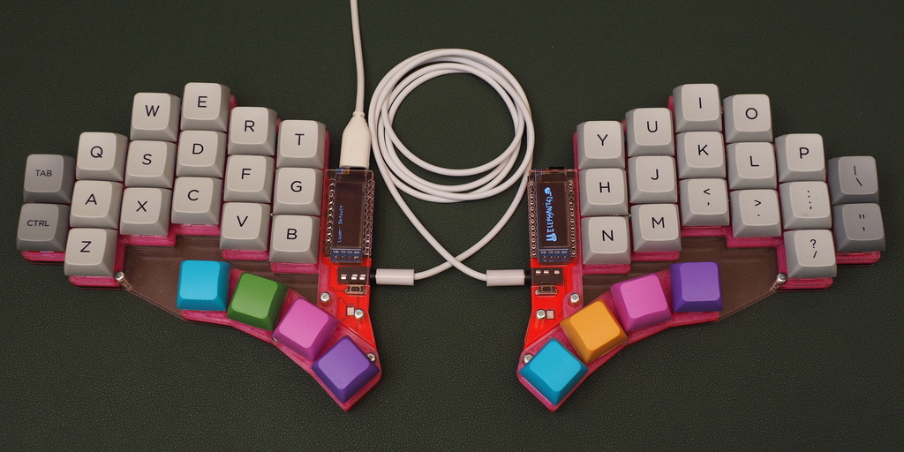
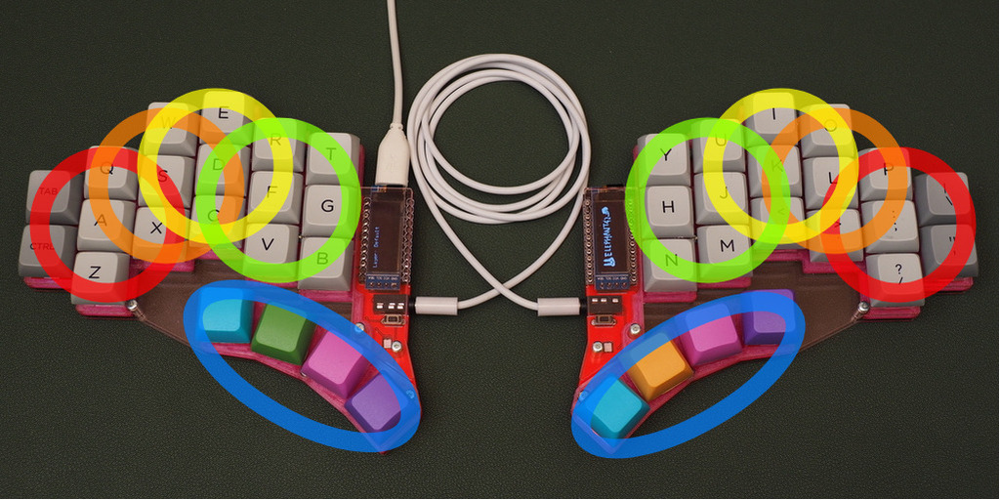
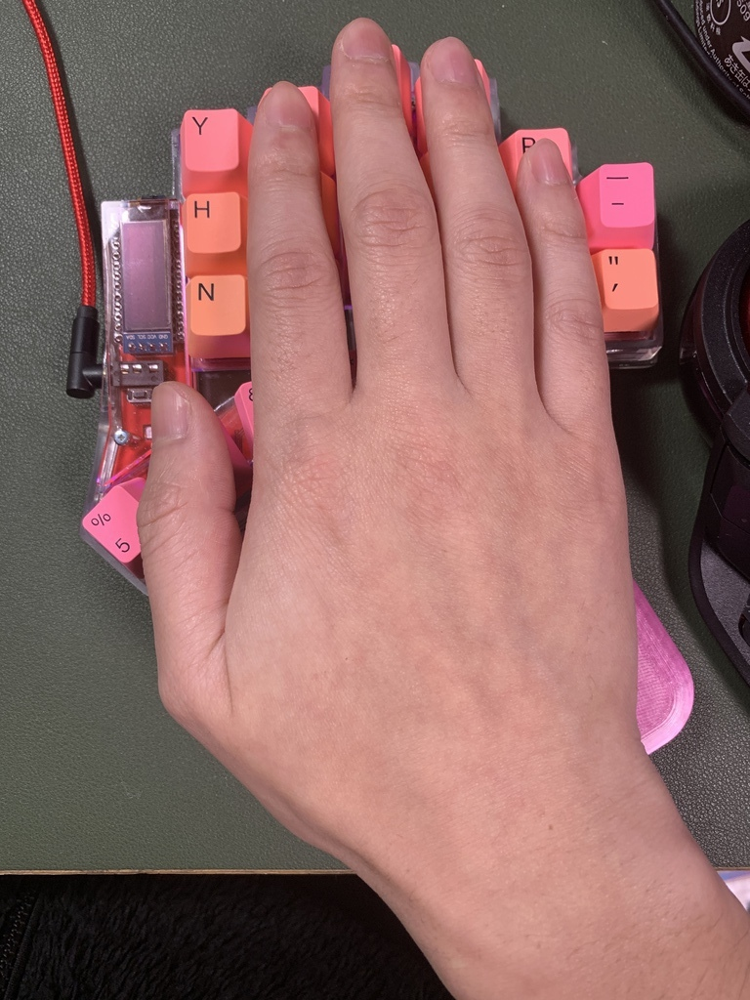
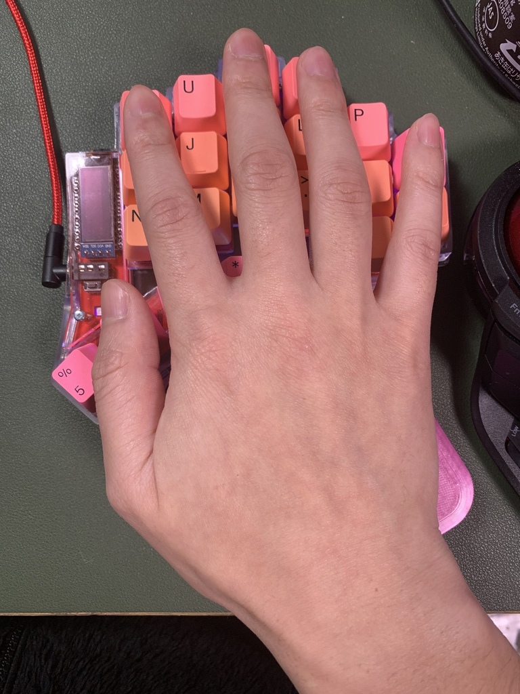
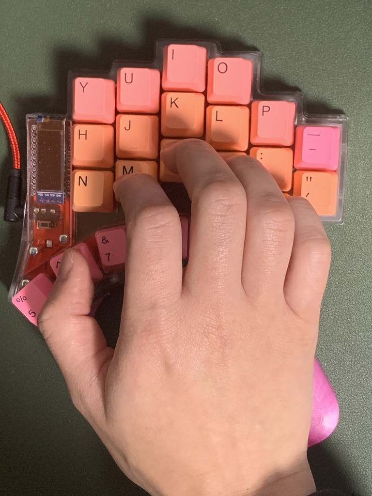
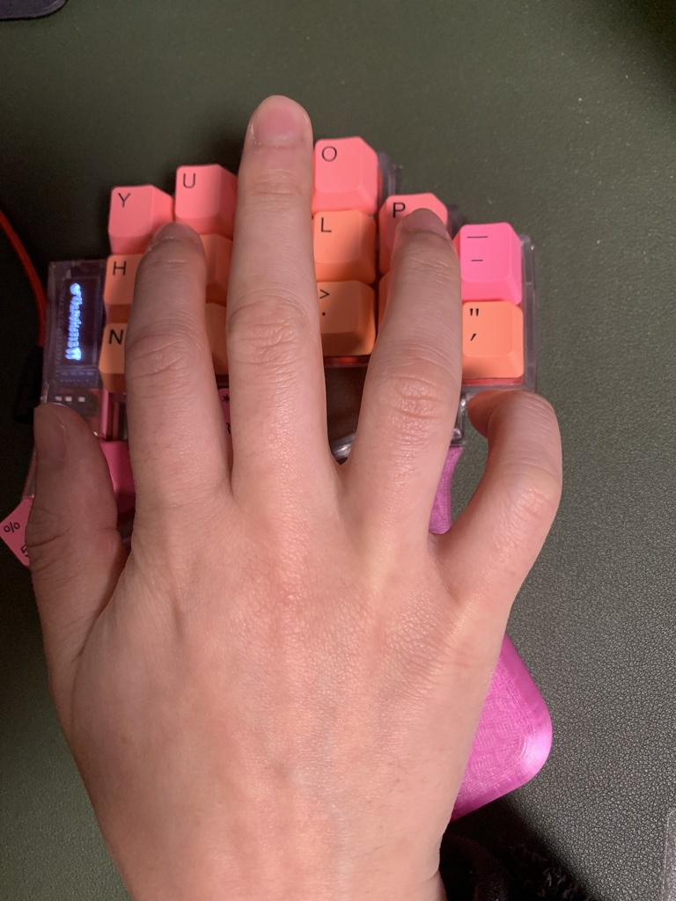
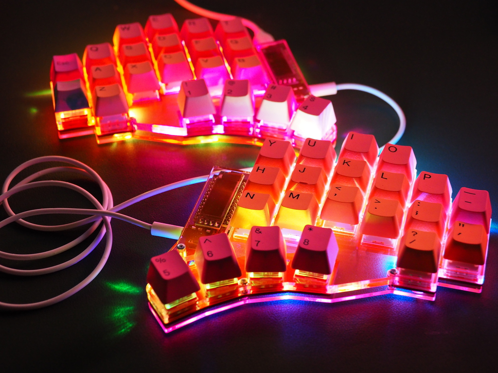

<h3>elephant42</h3>
<h1>
わたしの最高のキーボード。 
あなたにも最高のキーボード。
</h1>

<h2>手のひらを研究し尽した、パワフルで洗練された物理配列、美しく飽きのこないデザイン、メンテナンスを通して末永く愛用していける設計。elephant42 は、そんな誰もが望むような理想像を目指し、その理想を体現できるように作られました。 
幅広いジャンルのプロキーボードユーザーが、タイピング速度の限界を軽々と超えていけるように作られた最高のキーボードです。
</h2>

.

.

.

.

.

.

.

.

.

.

.

# 変則6列3行 column-staggard 配列

<!--

いわゆる「普通のキーボード」は横方向に揃い、縦方向は 1 キーの 1/2 ないし 1/4 ずつズレていく "Row-Staggard" と呼ばれる配列ですが、これはタイプライターの機械的な内部構造の都合のためのもので、人間の身体にあわせて設計されたものではないそうです。

このため、自作キーボード界隈では格子状にキーの並んだ "Ortholinear" や elephant42 のように縦方向にキーの揃った "Column-Staggard" という配列が考案され、Row-Staggard に負けずとも劣らない人気を博しています。

私はこの Column-Staggard を非常に気にいっており、この配列を採用するキーボードで特に違いの出る「各列のズレ具合をどれくらいずつ付けていくか」「親指キーをどのように、いくつ配置するか」という点について、自分の考えるベスト・オブ・ベストを研究し、それを実現するために elephant42 を制作しました。
-->

## ホームポジションから、最小限の動作で最大限のパフォーマンス。

elephant42 では、もっともリラックスしている状態の手の形をホームポジションとし、そこから無理なく高速に動かせる範囲のみにキーを集め、配置しています。文字置こしやプログラミング、ゲームなどあらゆるシーンで、これまでのキーボードにはない高効率で一切の無駄のない正確無比な打鍵を実現します。

<!--
## 各指の長さを考慮した列間のズレ調整

人間の手の大きさや形などはそれぞれ十人十色、みんな異なります。そのなかで万人に共通して打ちやすいキーボードを作ろうという目的はかなり無理があります。そのため、自分にとって最高のキーボードを作成しておけば、自分の手の形に近い人たちはみんな最高になれると考えました。
そのため、私の手の形に近い人は elephant42 が向いていると言えるでしょう。

厳密には、キーの大きさは規格で決まっているので、手の大きさの違いはあまり関係ありません。各指の長さの比率 ([指比](https://ja.wikipedia.org/wiki/%E6%8C%87%E6%AF%94)って言うらしいです) が重要となります。
elephant42 は薬指より人差し指が目に見えて短かく、それらよりさらに小指が大幅に短かいような手に最適化して作られています。

|  |  |  |
|:--:|:--:|:--:|
| elephant42にうってつけの手 | 最上段にフィットしている図 (閉じてるとき) | 最上段にフィットしている図 (開いたとき) |
 

写真を見てもわかる通り、自然に打鍵できる範囲内で一番指が伸びてるなって位置あたりに最上段のキーが来るようになっています。つまり指を伸ばしても届かない(手を動かさないと押せない)キーはないということです。

そしてその位置から自然に指を曲げていくと、自然と最下段に行き着きます。最下段もまた無理に押すようなことがない高さとなり、スムーズに指を運ぶことができるかと思います。

ところで、一番外側の列だけは 3 段でなく 2 段となっています。小指はどうしても短かく、開いた状態で曲げて無理なく打鍵できる範囲は限られています。一番外側の列を 3 段にしようとすると、上段下段はどうしても押せなくはないけど微妙に押しにくいキーとなってしまいます。 elephant42 は無理に外側を 3 段にして微妙なキーを 2 つ作るよりも外側を 2 段にする代わりどちらも問題なくスムーズに打鍵できる方を取りました。

|  |  | |
|:--:|:--:|:--:|
|  最下段にフィットしている図 | 外側列は 2 段が限界! ||
-->

# デザイン

## 透けてるってカッコイイ。

elephant42 の外観は、キーボードとしての設計思想と同じく必要十分に洗練されています。キーの周囲には無用な余白や装飾などは一切なく、必要以上に場所を取りません。
また大きな特徴である親指キーと他キーとの間に机が透ける構造や、美しく側面を光らせる蛍光エッジ・アクリルは、まるでキーボードが机から浮いているかのような美しさを演出します。

## 自らの力で、輝く。

フルカラーシリアル LED によるバックライトおよびアンダーグロウライトは、暗闇のなかでキー刻印を判断する、現在のキーレイヤの状態を表現するといった実用的目的にも、ただ単純に虹色に輝いて気分を盛り上げるためにも欠かすことはできません。もちろん集中して作業したい時のために光量を調整したり、ライト自体をオン/オフすることだって思いのまま。
また、最新の YS-SK6812MINI-E を使用しているので、従来のように持ち運びや打鍵の振動などで LED が故障する心配も激減。組立もぐっと簡単になりました。
