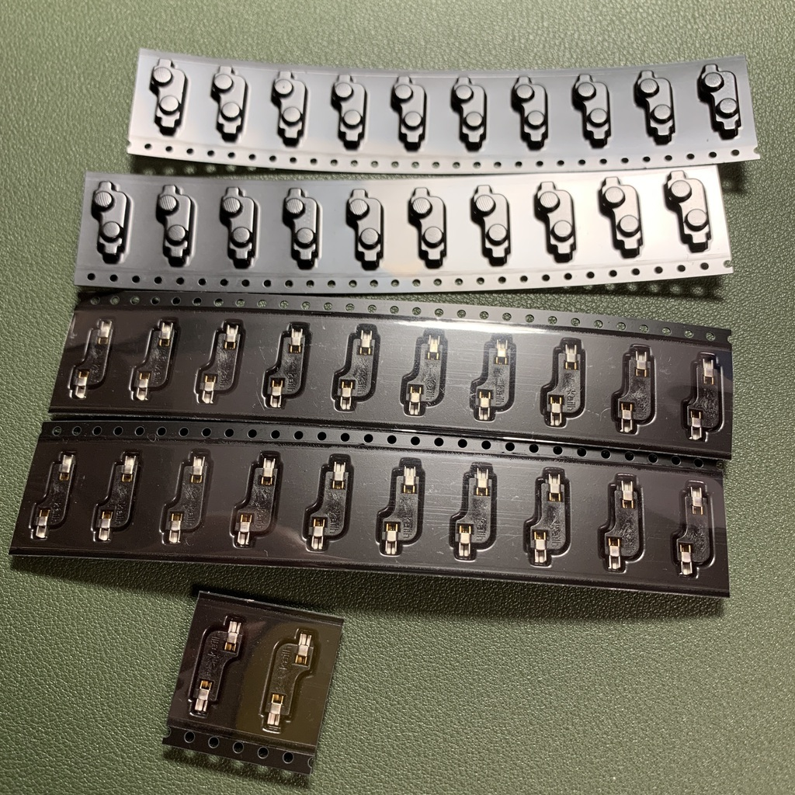
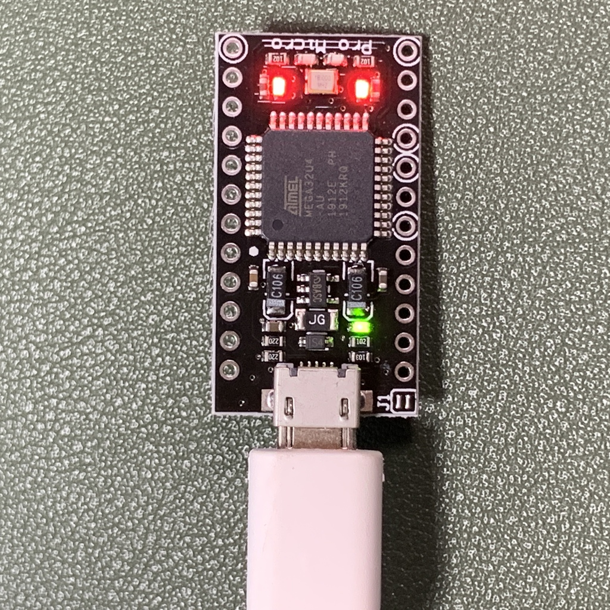
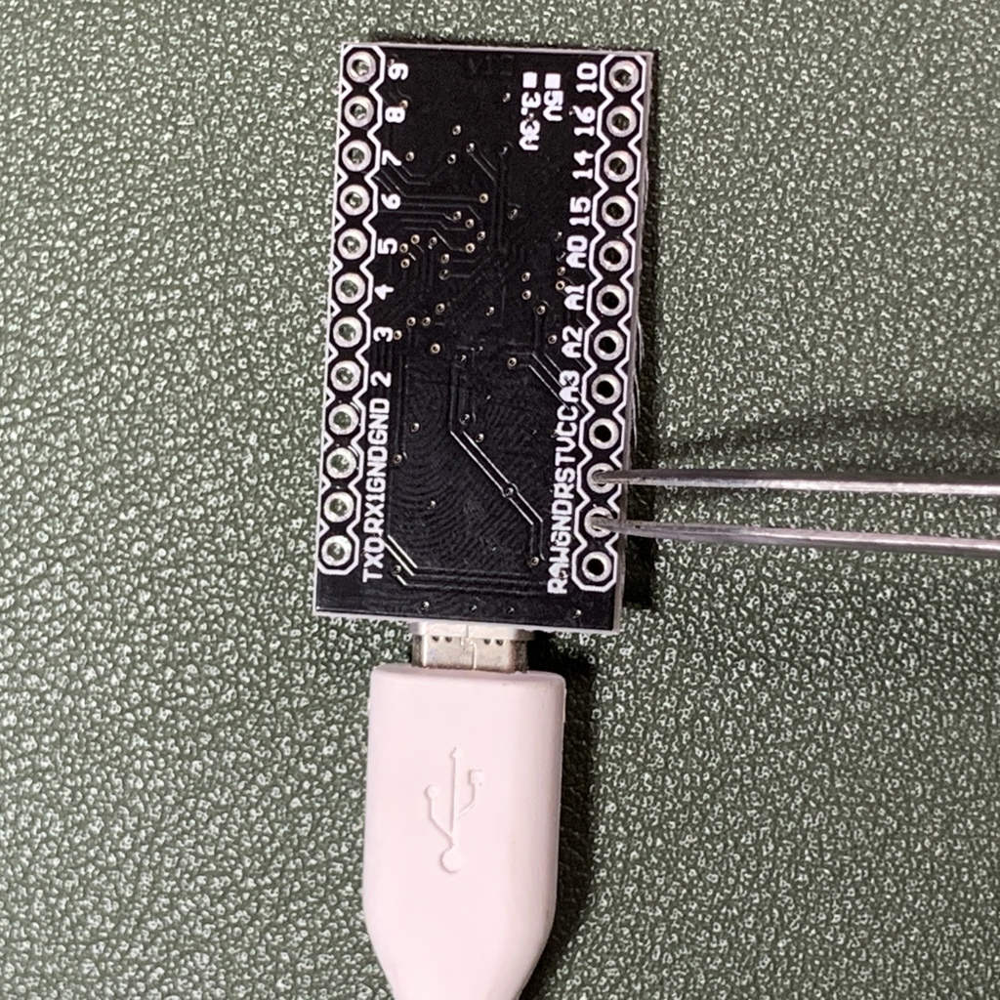
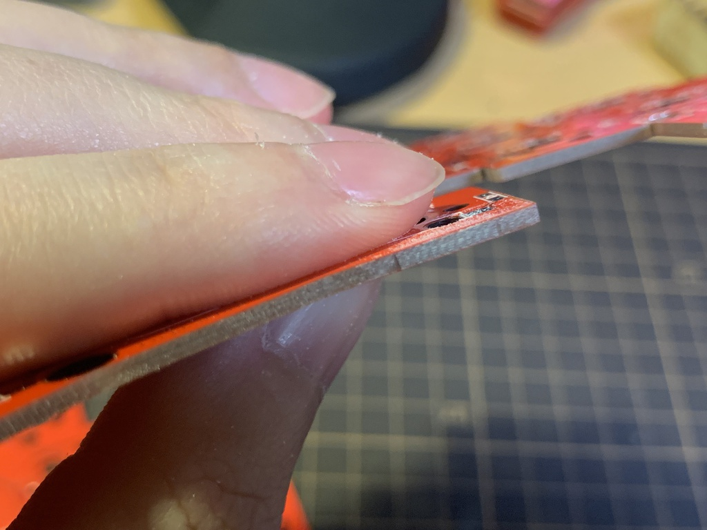
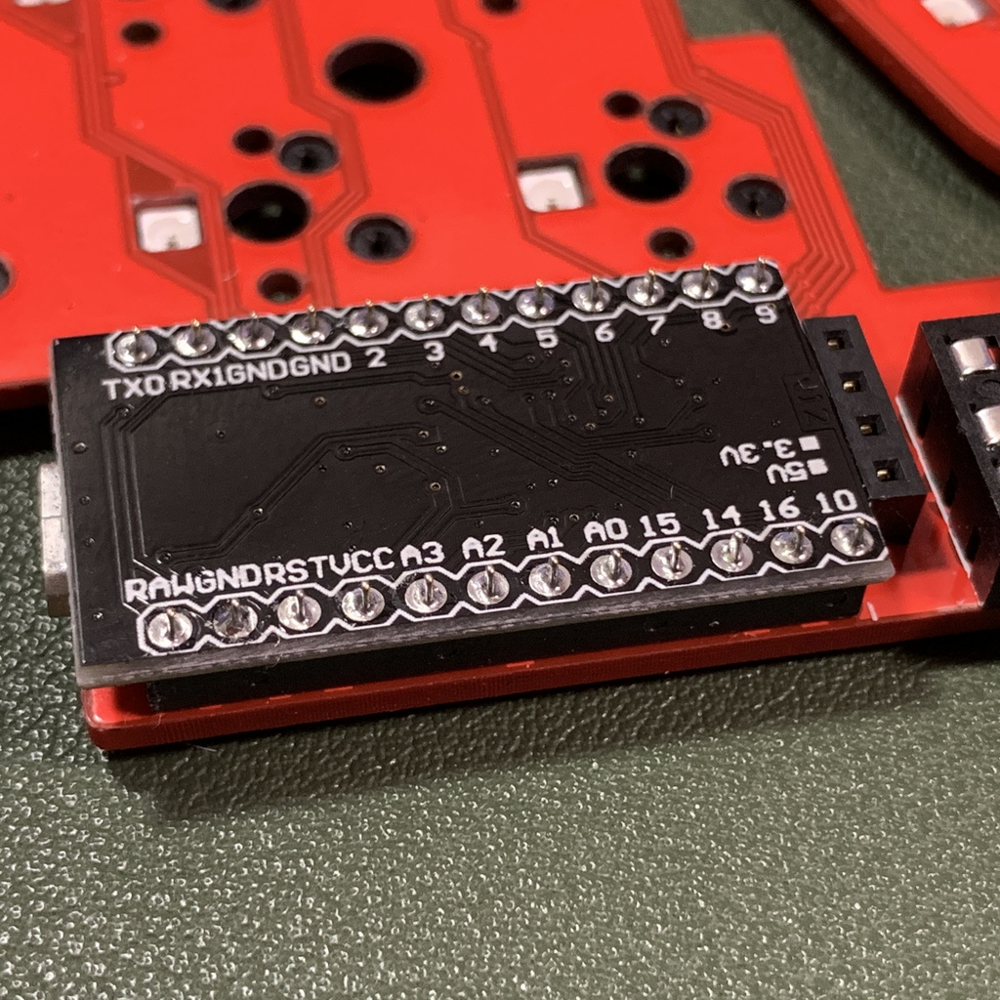
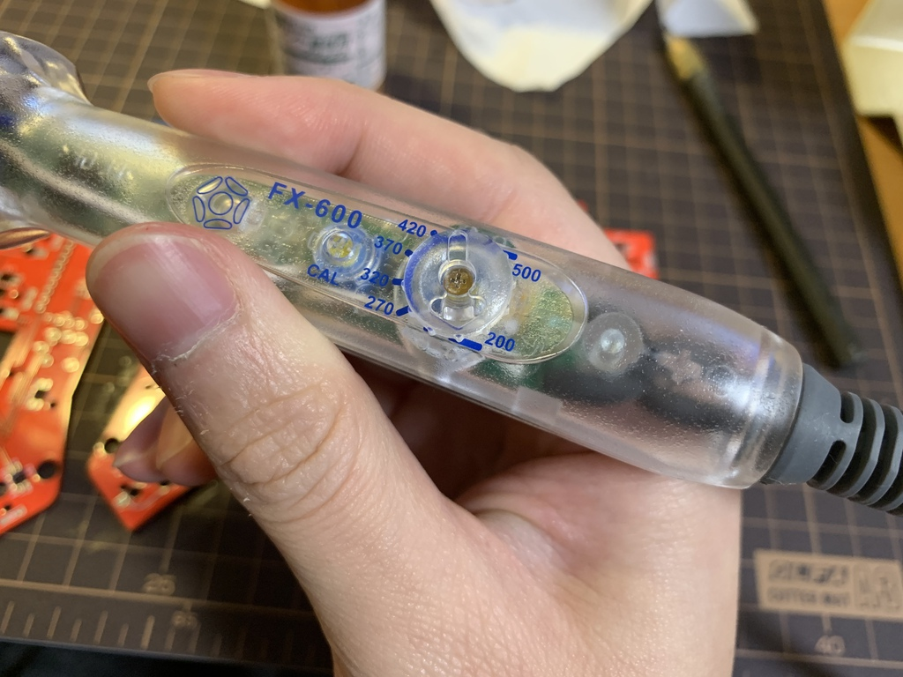
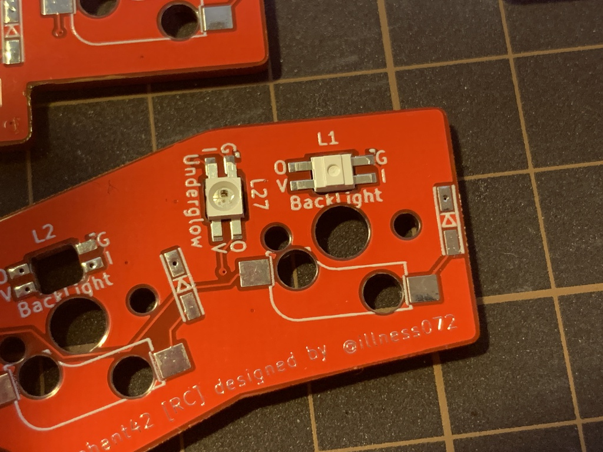
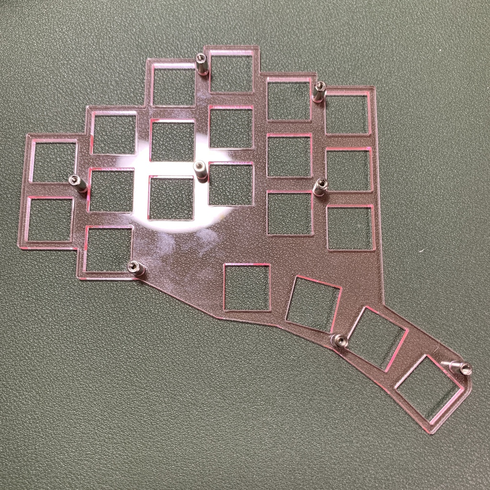
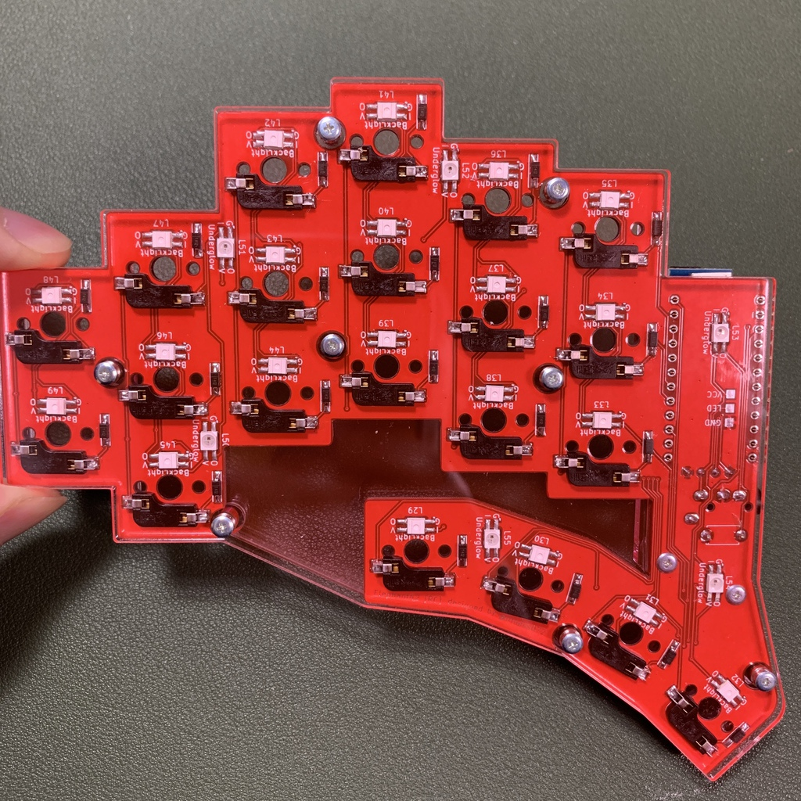
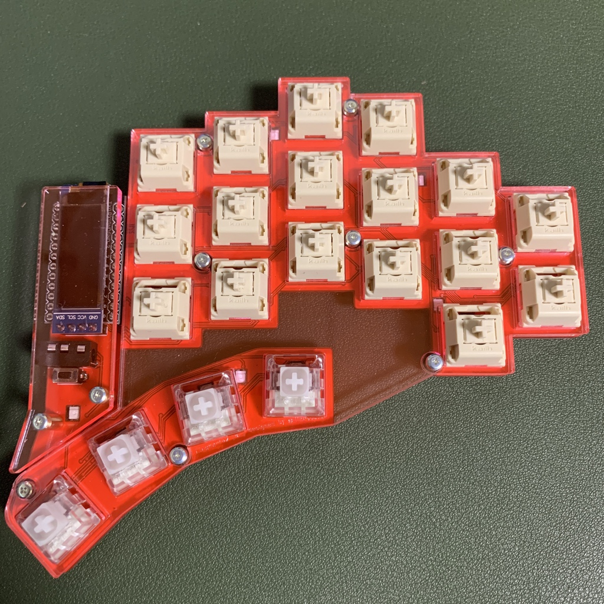

# elephant42 の組み立てかた

自作キーボードキット [elephant42](https://illness072.booth.pm/items/1775017) のビルドガイド(組立説明書)です。

**組み立ての前に、このビルドガイドを先に読んで理解して、材料・工具等を揃え、環境構築をし、最後に実際の組立作業を行ってください。**

**なにか良くわからない、うまくいかないときは、ガッカリしてそこで諦めてしまわずに[私に連絡](https://twitter.com/illness072/)してみてください。できる限り力になる努力をしたいと思います。**

「なにをしようとして」「なにをしたけど」「どうなってしまっているのか」をわかりやすいように質問して頂けるとスムーズです。


<!-- START doctoc generated TOC please keep comment here to allow auto update -->
<!-- DON'T EDIT THIS SECTION, INSTEAD RE-RUN doctoc TO UPDATE -->


- [準備](#%E6%BA%96%E5%82%99)
  - [キット内容の確認](#%E3%82%AD%E3%83%83%E3%83%88%E5%86%85%E5%AE%B9%E3%81%AE%E7%A2%BA%E8%AA%8D)
  - [必要部品の調達](#%E5%BF%85%E8%A6%81%E9%83%A8%E5%93%81%E3%81%AE%E8%AA%BF%E9%81%94)
    - [必須](#%E5%BF%85%E9%A0%88)
    - [オプション](#%E3%82%AA%E3%83%97%E3%82%B7%E3%83%A7%E3%83%B3)
  - [工具の準備](#%E5%B7%A5%E5%85%B7%E3%81%AE%E6%BA%96%E5%82%99)
    - [必要なもの](#%E5%BF%85%E8%A6%81%E3%81%AA%E3%82%82%E3%81%AE)
    - [あると良いもの](#%E3%81%82%E3%82%8B%E3%81%A8%E8%89%AF%E3%81%84%E3%82%82%E3%81%AE)
    - [買い物をする上で参考になるもの](#%E8%B2%B7%E3%81%84%E7%89%A9%E3%82%92%E3%81%99%E3%82%8B%E4%B8%8A%E3%81%A7%E5%8F%82%E8%80%83%E3%81%AB%E3%81%AA%E3%82%8B%E3%82%82%E3%81%AE)
  - [(初心者向け) はんだ付けの勉強](#%E5%88%9D%E5%BF%83%E8%80%85%E5%90%91%E3%81%91-%E3%81%AF%E3%82%93%E3%81%A0%E4%BB%98%E3%81%91%E3%81%AE%E5%8B%89%E5%BC%B7)
  - [QMK firmware ビルド環境の構築](#qmk-firmware-%E3%83%93%E3%83%AB%E3%83%89%E7%92%B0%E5%A2%83%E3%81%AE%E6%A7%8B%E7%AF%89)
  - [Pro Micro のもげ対策](#pro-micro-%E3%81%AE%E3%82%82%E3%81%92%E5%AF%BE%E7%AD%96)
- [組み立て作業](#%E7%B5%84%E3%81%BF%E7%AB%8B%E3%81%A6%E4%BD%9C%E6%A5%AD)
  - [(オプション) ファームウェアの OLED オプションの有効化](#%E3%82%AA%E3%83%97%E3%82%B7%E3%83%A7%E3%83%B3-%E3%83%95%E3%82%A1%E3%83%BC%E3%83%A0%E3%82%A6%E3%82%A7%E3%82%A2%E3%81%AE-oled-%E3%82%AA%E3%83%97%E3%82%B7%E3%83%A7%E3%83%B3%E3%81%AE%E6%9C%89%E5%8A%B9%E5%8C%96)
  - [QMK firmware の書き込み](#qmk-firmware-%E3%81%AE%E6%9B%B8%E3%81%8D%E8%BE%BC%E3%81%BF)
    - [QMK 書き込み トラブルシューティング](#qmk-%E6%9B%B8%E3%81%8D%E8%BE%BC%E3%81%BF-%E3%83%88%E3%83%A9%E3%83%96%E3%83%AB%E3%82%B7%E3%83%A5%E3%83%BC%E3%83%86%E3%82%A3%E3%83%B3%E3%82%B0)
  - [メイン基板 (PCB) の分割](#%E3%83%A1%E3%82%A4%E3%83%B3%E5%9F%BA%E6%9D%BF-pcb-%E3%81%AE%E5%88%86%E5%89%B2)
    - [(オプション) PCB 側面の色塗り](#%E3%82%AA%E3%83%97%E3%82%B7%E3%83%A7%E3%83%B3-pcb-%E5%81%B4%E9%9D%A2%E3%81%AE%E8%89%B2%E5%A1%97%E3%82%8A)
  - [Pro Micro とコンスルーのはんだ付け](#pro-micro-%E3%81%A8%E3%82%B3%E3%83%B3%E3%82%B9%E3%83%AB%E3%83%BC%E3%81%AE%E3%81%AF%E3%82%93%E3%81%A0%E4%BB%98%E3%81%91)
  - [(オプション) バックライト/アンダーグロウ LED の取り付け](#%E3%82%AA%E3%83%97%E3%82%B7%E3%83%A7%E3%83%B3-%E3%83%90%E3%83%83%E3%82%AF%E3%83%A9%E3%82%A4%E3%83%88%E3%82%A2%E3%83%B3%E3%83%80%E3%83%BC%E3%82%B0%E3%83%AD%E3%82%A6-led-%E3%81%AE%E5%8F%96%E3%82%8A%E4%BB%98%E3%81%91)
    - [バックライト LED の取り付け](#%E3%83%90%E3%83%83%E3%82%AF%E3%83%A9%E3%82%A4%E3%83%88-led-%E3%81%AE%E5%8F%96%E3%82%8A%E4%BB%98%E3%81%91)
    - [LED TEST の方法](#led-test-%E3%81%AE%E6%96%B9%E6%B3%95)
    - [アンダーグロウ LED の取り付け](#%E3%82%A2%E3%83%B3%E3%83%80%E3%83%BC%E3%82%B0%E3%83%AD%E3%82%A6-led-%E3%81%AE%E5%8F%96%E3%82%8A%E4%BB%98%E3%81%91)
    - [LED 取り付け トラブルシューティング](#led-%E5%8F%96%E3%82%8A%E4%BB%98%E3%81%91-%E3%83%88%E3%83%A9%E3%83%96%E3%83%AB%E3%82%B7%E3%83%A5%E3%83%BC%E3%83%86%E3%82%A3%E3%83%B3%E3%82%B0)
  - [ダイオードの取り付け](#%E3%83%80%E3%82%A4%E3%82%AA%E3%83%BC%E3%83%89%E3%81%AE%E5%8F%96%E3%82%8A%E4%BB%98%E3%81%91)
  - [スイッチソケットの取り付け](#%E3%82%B9%E3%82%A4%E3%83%83%E3%83%81%E3%82%BD%E3%82%B1%E3%83%83%E3%83%88%E3%81%AE%E5%8F%96%E3%82%8A%E4%BB%98%E3%81%91)
  - [TRRS ジャック、リセットスイッチの取り付け](#trrs-%E3%82%B8%E3%83%A3%E3%83%83%E3%82%AF%E3%83%AA%E3%82%BB%E3%83%83%E3%83%88%E3%82%B9%E3%82%A4%E3%83%83%E3%83%81%E3%81%AE%E5%8F%96%E3%82%8A%E4%BB%98%E3%81%91)
  - [(オプション) OLED の取り付け](#%E3%82%AA%E3%83%97%E3%82%B7%E3%83%A7%E3%83%B3-oled-%E3%81%AE%E5%8F%96%E3%82%8A%E4%BB%98%E3%81%91)
  - [動作確認](#%E5%8B%95%E4%BD%9C%E7%A2%BA%E8%AA%8D)
    - [動作確認 トラブルシューティング](#%E5%8B%95%E4%BD%9C%E7%A2%BA%E8%AA%8D-%E3%83%88%E3%83%A9%E3%83%96%E3%83%AB%E3%82%B7%E3%83%A5%E3%83%BC%E3%83%86%E3%82%A3%E3%83%B3%E3%82%B0)
    - [フラックスの洗浄](#%E3%83%95%E3%83%A9%E3%83%83%E3%82%AF%E3%82%B9%E3%81%AE%E6%B4%97%E6%B5%84)
  - [ねじ留め](#%E3%81%AD%E3%81%98%E7%95%99%E3%82%81)
  - [(オプション) 完成を喜ぶ](#%E3%82%AA%E3%83%97%E3%82%B7%E3%83%A7%E3%83%B3-%E5%AE%8C%E6%88%90%E3%82%92%E5%96%9C%E3%81%B6)
- [カスタマイズする](#%E3%82%AB%E3%82%B9%E3%82%BF%E3%83%9E%E3%82%A4%E3%82%BA%E3%81%99%E3%82%8B)
  - [キーマップのカスタマイズ](#%E3%82%AD%E3%83%BC%E3%83%9E%E3%83%83%E3%83%97%E3%81%AE%E3%82%AB%E3%82%B9%E3%82%BF%E3%83%9E%E3%82%A4%E3%82%BA)
  - [OLED のカスタマイズ](#oled-%E3%81%AE%E3%82%AB%E3%82%B9%E3%82%BF%E3%83%9E%E3%82%A4%E3%82%BA)
  - [アクリルプレートのカスタマイズ](#%E3%82%A2%E3%82%AF%E3%83%AA%E3%83%AB%E3%83%97%E3%83%AC%E3%83%BC%E3%83%88%E3%81%AE%E3%82%AB%E3%82%B9%E3%82%BF%E3%83%9E%E3%82%A4%E3%82%BA)
- [さいごに](#%E3%81%95%E3%81%84%E3%81%94%E3%81%AB)

<!-- END doctoc generated TOC please keep comment here to allow auto update -->


# 準備

## キット内容の確認

内容物に不足や破損などがないか確認してください。

|  |  |  |  |
|:--:|:--:|:--:|:--:|
|メイン基板(PCB) ... 1枚<br/>**※1**|トッププレート ... 2枚<br/>(薄くて穴が小さい方)|ミドルプレート ... 2枚<br/>(厚くて穴が大きい方)|ボトムプレート ... 2枚|
|  |  |  |  |
| ProMicro 保護プレート ... 2枚<br/>**※2** | ダイオード ... 44個<br/>(予備2個) | MX 互換スイッチ用<br/>PCB ソケット ... 42個 | TRRS ジャック ... 2個 |
|  |  |  |  |
| タクトスイッチ ... 2個<br/>※色は異なる場合があります | スペーサー(短) ... 20本 | スペーサー(長) ... 4本 | ネジ ... 40本 |
|  ||||
| クッションゴム ... 10個 ||||

※1... v1から基板の色は白となりました。組み立て方に違いはありません。

※2... 初回生産分には、ProMicro 保護プレートは 2mm 厚のものが 2 枚、3mm 厚のものが 2 枚、計 4 枚含まれています。好みで選択してください。

## 必要部品の調達

キットに含まれていないが必要なものを購入します。

初心者向けのおすすめ購入先 (国内通販) のリンクも併せて載せておきますので参考にしてください。

### 必須

- **Pro Micro(コンスルー付き) ... 2組**
   - おすすめ購入先
     - [Pro Micro （コンスルー付き）| 遊舎工房](https://yushakobo.jp/shop/promicro-spring-pinheader/) ※2つ購入してください
     - TALP KEYBOARD
       - [Pro Micro ATmega32U4 5V/16MHz/MicroUSB2(互換品)](https://talpkeyboard.stores.jp/items/5b24504ba6e6ee7ec60063e3) ※2つ購入してください
       - [MAC8 コンスルー XB-3-2.5-12P (高さ2.5mm/12ピン/1個)](https://talpkeyboard.stores.jp/items/5e056626d790db16e2889233) ※4つ購入してください
     - Amazon などで非常に安価な Pro Micro が複数個セットで販売されていますが、結構な確率で粗悪品を掴むのでちゃんとした店で購入した方が無難です。
   - 国内キットでは同梱しているキットが多いですが、本キットは同梱していません。
- MX 互換スイッチ ... 42個
   - おすすめ購入先
     - [Switches | 遊舎工房](https://yushakobo.jp/product-category/switches/)
     - [TALP KEYBOARD](https://talpkeyboard.stores.jp/?category_id=59cf8860ed05e668db003f5d)
     - [SWITCHES - ゆかりキーボードファクトリー](https://eucalyn.shop/product-category/keyswitches)
   - 「Kailh ロープロファイル (Choc) スイッチ」および「Kailh Mid-Heightスイッチ」は非対応ですのでご注意ください。
- 1Uキーキャップ ... 42個
   - おすすめ購入先
     - [Keycaps | 遊舎工房](https://yushakobo.jp/product-category/keycaps/)
     - [TALP KEYBOARD](https://talpkeyboard.stores.jp/?category_id=59be183f428f2d49120007b1)
     - [KEYCAPS - ゆかりキーボードファクトリー](https://eucalyn.shop/product-category/keycaps)
     - [Tai-Hao shop](https://shop.tai-hao.com/) ※海外
   - キースイッチと同じく「Kailh ロープロファイル (Choc) スイッチ」用のキーキャップは非対応ですのでご注意ください。
- TRSケーブル ... 1本
    - AUX ケーブル、ステレオミニプラグケーブルなどとも呼ばれています。所謂イヤホンのプラグが両方についてるケーブルです。
      - Amazon などで見た目が良いものが売られています
    - elephant42 が必要とするのは 3 極(黒線が2本入るタイプ)の TRS ケーブルですが、自作キーボードショップなどでよく売られている 4 極(黒線が3本入るタイプ) の TRRS ケーブルでも代用可能です。
      - [TRRSケーブル 1m | 遊舎工房](https://yushakobo.jp/shop/trrs_cable/)
- USB ケーブル (Type-A to Micro-B) ... 1本
    - 所謂 Micro USB ケーブルです。
      - Amazon などで見た目が良いものが売られています
      - [USBケーブル Micro B 1m | 遊舎工房](https://yushakobo.jp/shop/usb_cable_micro_b/)
      - [USB2.0ケーブル（0.6m/USB(A)オス - USB(Micro-B)オス) | TALP KEYBOARD](https://talpkeyboard.stores.jp/items/5df82904a551d528d7360c34)


### オプション

1. OLEDモジュール（ピンソケット付き） ... 2個
    - [OLEDモジュール | 遊舎工房](https://yushakobo.jp/shop/oled/) ※ピンソケット付きを選択してください
1. YS-SK6812MINI-E ... 54個
    - [YS-SK6812MINI-E（10個入り） | 遊舎工房](https://yushakobo.jp/shop/ys-sk6812mini-e/) ※6パック購入してください(6個余ります)
    - **従来品の「[SK6812MINI](https://yushakobo.jp/shop/sk6812mini-35/)」は互換性がないため使用できません。**
    - **※遊舎工房実店舗で購入する場合、見た目が非常に似通っている「[リバースマウント RGB LED](https://yushakobo.jp/shop/a0800rl-10/)」を誤って購入しないよう注意してください。互換性がないため使用できません。**


## 工具の準備

組み立てだけでなく、修理などでも工具は必要になります。また特に電子工作は、良い工具を使うと作業がぐっと簡単になります。
お財布と相談しつつ、なるべく良い工具を揃えると良いでしょう。

また、自宅から通いやすい場所に工作スペースがある場合は、そちらの利用も考慮すると良いかもしれません。

### 必要なもの

- はんだ
  - [goot 高密度集積基板用はんだ SD-60](https://www.amazon.co.jp//dp/B0029LGAJI/)
    - ほとんどの部品はこちらで取り付けます
  - [久富電機産業 SH-43 低温はんだ](https://www.sengoku.co.jp/mod/sgk_cart/detail.php?code=6A2W-CFJP)
    - LED(YS-SK6812mini-E) だけは高温で壊れる危険性があるため、念のためこちらを使っています
- はんだ吸い取り線
  - [goot はんだ吸取り線 CP-3015](https://www.amazon.co.jp/dp/B001PR1KPQ)
- はんだこて
  - [白光 ダイヤル式温度制御はんだこて FX600](https://www.amazon.co.jp/dp/B006MQD7M4)
  - **温度調整機能つきを強くおすすめします**
- こて台
  - [白光(HAKKO) こて台 633-01](https://www.amazon.co.jp/dp/B000TGNWCS)
- フラックス
  - [goot プリント基板フラックス BS-75B ](https://www.amazon.co.jp/dp/B004ANR7KY/)
  - なくてもできる! という人をたまに見かけますが、ほぼ間違いなく腕を自慢したい上級者です。特に LED をつける場合はほぼ必須と思ってください。
- フラックスクリーナー
  - [太洋電機産業(goot) フラックスリムーバー BS-T20B](https://www.amazon.co.jp/dp/B07JHJHTYG/)
  - 無洗浄タイプのフラックスなら不要というわけではありません。茶色くベタベタして汚らしく、また経年劣化で基板にダメージを与えるらしいので、なるべく使用するようにしてください。
- キムワイプ
  - [日本製紙クレシア キムワイプ S-200 mini 62015 1個入](https://www.amazon.co.jp/dp/B00CWA23P6)
  - ティッシュでも代用可能ですが、あまりおすすめはしません。
- ふつうのピンセット
  - ダイソーで購入したものを使用。プラモデルと共用。
- ふつうのマスキングテープ
  - ダイソーで購入したものを使用。プラモデルと共用。
- 棒ヤスリ
  - ダイソーで購入したものを使用。プラモデルと共用。
- ふつうのカッターナイフ
  - 切れればなんでも良い。今回はプラモデルで使用するデザインナイフで代用。

### あると良いもの

- 油性ペン
  - 基板側面を塗るのに使います。お好みの色を用意してください。
  - ポスカが発色良くおすすめです。マッキーやプラモデルで使用するガンダムマーカーなどでも問題ありません。
- ふつうのニッパー
  - ダイソーで購入したものを使用
  - プラモデル用の良いニッパーは刃をダメにするので共用しないことをおすすめします。
- エポキシ系接着剤
  - ダイソーで購入したものを使用
- テスター
  - ほんとはあったほうが良いと思うけど、電池と電子ブザーとリード線を雑にくっつけただけの物を使用しています
- はんだ付け用作業マット
  - ほんとはあったほうが良いと思うけど、使ってません
- カッターマット
  - 机を傷つけなければ古新聞でも本キットの外箱でも何でも良い。今回はプラモデルで使用するものを使用

### 買い物をする上で参考になるもの

先人に学ぼう。

- [Helix キーボードキットの製作に必要な工具メモ | gist.github.com](https://gist.github.com/mtei/6957107a676ddfa85bde0ae41f8fa849)
- [第8回「自作キーボードのつくりかた #2」組み立てる道具とはんだ付け編 | Youtube](https://youtu.be/LOC53FeU-QM)
- [自作キーボードを作るために必要なもの | 自作キーボード温泉街の歩き方](https://salicylic-acid3.hatenablog.com/entry/2018/11/24/%E8%87%AA%E4%BD%9C%E3%82%AD%E3%83%BC%E3%83%9C%E3%83%BC%E3%83%89%E3%82%92%E4%BD%9C%E3%82%8B%E3%81%9F%E3%82%81%E3%81%AB%E5%BF%85%E8%A6%81%E3%81%AA%E3%82%82%E3%81%AE#%E8%87%AA%E4%BD%9C%E3%82%AD%E3%83%BC%E3%83%9C%E3%83%BC%E3%83%89%E3%81%A7%E5%BF%85%E8%A6%81%E3%81%AA%E3%82%82%E3%81%AE)
- [自作キーボードの組み立てに使っている工具 | yfuku blog](https://blog.yfuku.com/entry/keybord_build_tool)


## (初心者向け) はんだ付けの勉強

elephant42 は完成までに最低でもおよそ200箇所、最大でおよそ440箇所をはんだ付けすることになります。

人生初だったり、中学校以来久しぶりのはんだ付け、のような人はとくに、はんだ付けのやりかたを勉強しておくと良いです。

はやく完成させたい気持ちでここを飛ばしていきなり着手してしまうと、およそろくなメにあわないです。**ほんとに。**


はんだ付けの基本動作

https://youtu.be/ZA-ehWjRfYM

ProMicro、タクトスイッチ、TRRSジャックなどを実装する際にスルーホールをはんだ付けするため、こちらの動画で学習すると効率的です。

https://youtu.be/oq3Q3n57-B0

表面実装ダイオード、LEDなどをはんだ付けする方法は、こちらの動画で学習すると効率的でした。

https://youtu.be/vqKKElJ1vw0


## QMK firmware ビルド環境の構築

ファームウェアを準備するための手順はこちらに記述されています。

https://docs.qmk.fm/#/ja/newbs_getting_started


elephant42 は QMK Configurator や QMK Toolbox には対応していないため、上記URLを参考にビルド環境の構築を行ってください。

途中 `git clone --recurse-submodules https://github.com/qmk/qmk_firmware.git` を実行する箇所がありますが、elephant42 の場合は

```
git clone --recurse-submodules -b elephant42 https://github.com/illness072/qmk_firmware.git
```

としてください。

また、`make <keyboard>:default` の箇所は、

```
make elephant42:default
```

としてください。


## Pro Micro のもげ対策

必須ではありませんが、やっておくと悲しい思いをしなくなるので良いです。

以下の記事などを参考に、エポキシ接着剤を MicroUSB ジャック周辺に盛り付けて端子を強化します。

-  [ProMicroのモゲ防止ついでにQMK_Firmwareを書き込む](https://qiita.com/hdbx/items/2f3e4ddfcadda2a5578e)
- [マスキングテープを使って、安全にProMicroのモゲ対策をする](https://cnaos.hatenablog.com/entry/2019/03/16/153754)


# 組み立て作業

## (オプション) ファームウェアの OLED オプションの有効化

**※ OLED を取り付ける場合のみ実施してください。OLED を取り付けていないのにファームウェアで OLED オプションを有効にしてしまうと動作不良の原因となります。**

前章にて `git clone` した QMK ファームウェアの `keyboards/elephant42/rules.mk` をメモ帳などのテキストエディタで開き、

```
OLED_DRIVER_ENABLE = no      # Enable/Disable OLED driver.
```

となっている部分を、以下のように修正します。(`no` を `yes` にします)

```
OLED_DRIVER_ENABLE = yes     # Enable/Disable OLED driver.
```

これを保存し、ビルドし直してください。

```
make elephant42:default
```


## QMK firmware の書き込み

Micro USB ケーブルを Pro Micro に挿し、PC に接続したうえで

```
make elephant42:default:flash
```

とすると書き込みが実行されます。処理が進み、実際の書き込みを行う準備が整うと

```
Detecting USB port, reset your controller now...
```

と表示されるので、接続している ProMicro の RST と GND の両方を同時に一瞬だけピンセットなどで触れてショートさせます。

すると、Pro Micro のパワーランプが点滅し、実際の書き込みが開始されます。

最後に以下のような表示が出たら、書き込みは完了です。

```
avrdude done.  Thank you.
```

これを左右 2 つぶんの Pro Micro 両方に対して実施してください。

**このとき、Pro Micro を勢いよく引っこ抜くと Micro USB ジャック が基板からもげて使い物にならなくなってしまいます。細心の注意を払ってゆっくり優しく真っ直ぐに抜くようにしてください。**

|  |  |
|--|--|
| PC に ProMicro を接続し、書き込みコマンドを起動します | 待機状態になったら、RST と GND を一瞬ショートさせて書き込み処理を実行します |


### QMK 書き込み トラブルシューティング

一部の環境では、コマンド実行時に以下のようなメッセージが出ることがあります。このときはそのまま Enter を押してしばらく待ち、書き込みが失敗して終わるのを待ちます。

```
sh: /tmp/1: Permission denied
.override rw-r--r--  root/wheel for /tmp/1? (y/n [n])
```

このように `permission denied` という文字列がでてエラーとなる場合は、

```
sudo make elephant42:default:flash
```

と書き換えて実行することで成功することができるかと思います。(パスワード入力を求められると思うので、アカウントのパスワードを入力してください。このとき画面には `****` だとか `●●●●` だとかは一切表示されませんが、それが普通なので気にせずパスワードを入力してEnterを押してください。)

## メイン基板 (PCB) の分割

PCB を 2 つに分割します。ミシン目に沿ってカッターで切り込みを入れ、手でゆっくり力をかけて折りとり、棒やすりで断面を整えます。

**カッターで基板の他の部分を傷つけないよう注意してください。**
**基板を折るさい、他の部分が折れたり曲がったりしないよう対象箇所のすぐそばを持って力を加えてください。**

|  |  |
|:--:|:--:|
| PCB を取り出し、カッターマットの上に置きます | ミシン目に沿って、カッターで切り込みを入れます。<br/>他の部分に傷をつけないよう、弱めの力で何十回も刃を当てます。 |
|  |  |
| 両サイド両面、ぜんぶで4箇所に切り込みを入れおわりました。 | 他の部分が折れたり曲がったりしないよう注意して折ります。<br/>固いようなら無理して折りとろうとせず、さらにカッターで深く切り込みを入れ直してください。 |
|  |  |
| 両サイドとも無事綺麗に折れました。真ん中の小さな破片は不要なので捨てます。 | 折り取った面はギザギザで危ないので、棒やすりで綺麗にします。<br/>やすりがけ作業は粉が飛び散るので、掃除しやすい場所で汚れても良い格好で行うことをおすすめします。 |
|  |
| 綺麗になりました。周囲を指でなぞって真っ平らになっていれば、微妙に縦線が入って見えていても大丈夫です。 |


### (オプション) PCB 側面の色塗り

写真の通り、 PCB 側面はなんか変な色で見栄えが悪く、また完成後もよく見えてしまうので色を塗ってしまうことをおすすめします。

油性ペンで側面をなぞり、表面や裏面についてしまったインクはティッシュやキムワイプで拭き取ります。

|  |  |
|:--:|:--:|
| PCB側面をペンで塗ります。はみだしたらすぐに拭き取ります | その後すぐに作業をすると手が汚れるので、乾かします。 |


## Pro Micro とコンスルーのはんだ付け

コンスルーの向きを確認し、写真を参考にして Pro Micro に嵌め込みます。

ProMicro とコンスルーが直角に取り付けられるよう、メイン基板 (PCB) にも嵌め込んだうえでコンスルーと ProMicro をはんだ付けします。

**はんだ付けするのは ProMicro とコンスルーで、メイン基板 (PCB) とコンスルーははんだ付けしません。**

ProMicro とコンスルーのはんだ付けが済んだら、ProMicro(とコンスルーをはんだ付けしたもの) は一度メイン基板から取り外しておきます。


|  |  |
|:--:|:--:|
| コンスルーには向き(窓があいてる/あいてない)があります。 | コンスルーの向きを揃えて、 ProMicro のチップが見える側の面に挿します。 |
|  |  |
| 反対から見た図。コンスルーの向きが揃っているのを確認します。 | メイン基板 (PCB) に嵌めたうえで、各ピンを上からはんだ付けします。<br/>(写真を撮り忘れて後から撮影したので、ProMicro 以外のものも取り付けられていますが見なかったことにしてください。) |


## (オプション) バックライト/アンダーグロウ LED の取り付け


フルカラー LED の取り付けといえば自作キーボード界では最難関の一つとされる作業ですが、新型 LED の登場によりこれまでより格段にラクで安全に取り付けができるようになりました。

以前に挫折した経験のあるかたも、今回あらためて挑戦してみてはいかがでしょう？


### バックライト LED の取り付け

まずはバックライト LED (左手:L1〜L21、右手: L29〜L49) だけ取り付けてしまいます。左右 21 個ずつ、計 42 個取り付けます。

はんだ付けにはフラックスを使用すると簡単・綺麗に、かつしっかりと接着させることができます。

LED は非常に小さいパーツなので、ぶち撒けて悲しい気持ちにならないよう少しずつ取り出して取り付けると良いです。

|  |  |
|:--:|:--:|
| はんだごての温度を低めに設定すると LED を焼き切ってしまう可能性が格段に減ります。<br/>使用するはんだの融点を確認して、なるべく低温で作業してください。 | PCB は裏向き(銀色のパッドが上に来る) に置きます。 |
|  |  |
| LED は白い文字(シルク)で Backlight あるいは Underglow と書かれた四角い穴に取り付けます。<br/>**L1, L2, ... と書かれた取り付け番号順に従って取り付けていってください。** | LED は向きがあります。Backlight は下向きに、Underglow は上向きに配置します。<br/>また LED から伸びた 4 本のタブのうち 1 つだけ切り欠きがあるので、そのタブが 'G' の位置に来るようにします。<br/>**向きが間違っているとLEDは点灯せず、最悪キーボード自体の故障にもつながります。細心の注意をはらって配置してください。** |
|  |  |
| 図のように親指側から小指の順に、LED取り付け穴のそばにある白字の L1, L2 ... の記載(シルク)の番号順にそって取り付けます。 | L1 をはんだ付けしました。LEDのタブが基板から浮いていないか、しっかり目視確認してください。 |


### LED TEST の方法

LED 取り付けば 1 個から数個とりつけるたびに動作確認をしていくとスムーズです。


LED の動作確認用のファームウェアは以下のコマンドで書き込みができます。先ほどの [QMK firmware の書き込み](#qmk-firmware-の書き込み) の手順を参考に書き込んでください。

```
make helix:led_test:flash
```

このファームウェアを焼き込んだ状態の ProMicro を PCBに挿して PC に接続すると「赤→緑→青→赤→...」と順番に点灯してくれます。  
正しく「赤→緑→青→赤→...」とすべての LED が点灯しているかどうかではんだ付けが成功してるかどうか確認できます。

PC がスリープ中だと赤くだけ光って色が変わってくれないことがあります。  
PC がスリープしてない普通の時にテストしましょう。

**良いかんじに取り付け＆テストが進んでいる様子**

|  |  |  |  |  |
|:--:|:--:|:--:|:--:|:--:|
|親指のバックライトが光りました|人差し指も光りました|続いて中指と薬指。もうちょっと!|小指も完了。これでバックライトは完了!|アンダーグラウンドもOK。<br/>片手ぶんすべて完了!!|

### アンダーグロウ LED の取り付け

バックライト LED の取り付けが完了して、LED TEST もすべてパスしたらアンダーグロウ LED  (左手:L22〜L27、右手: L50〜L55) の取り付けに取り掛かります。左右 6 個ずつ、計 12 個取り付けます。

|  |  |
|:--:|:--:|
| 次はアンダーグロウです。バックライト同様、シルクの番号順に取り付けます。 | L27 を取り付けました。バックグラウンドとアンダーグロウは表裏が逆になるので注意してください。 |


### LED 取り付け トラブルシューティング

**取り付け穴がきつくて LED が嵌らない**

基板製造の製造誤差によりこうなってしまう場合があります。十分に検品しているつもりですが、抜けがあってすみません。

このような場合は無理に押し込まず、LED 穴の内側を棒やすりで少し削り、穴を広げてみてください。

**光らない LED がある**

その光らない LED か、その 1 つ前の LED がおかしい可能性が高いです。

elephant42 に使用されている YS-SK6812MINI-E でなく、その改良前版の SK6812MINI についての記事ですが、
デバッグ方法がこちらの記事に詳しく書かれていますので、熟読されることをおすすめします。

[コルネキーボードを作りました ～LED取り付けに四苦八苦記～ | キオクノロンダリング](https://marksard.github.io/2018/08/04/make-the-crkbd/) 

YS-SK6812MINI-E のピンアサインは以下の通りなので、SK6812MINI のそれとは異なります。適宜読み替えてください。

|  |  |
|:--:|:--:|
| LED ピンアサイン(表) | LED ピンアサイン(裏) |

**LED取り付け間違えちゃった!!**

LED の修正で大事な事は、**あわててすぐに取り外さないこと** です。

基本的に、LED自体が壊れるか、向きを間違っているかでなければ、上から温めなおしたり追いはんだをするだけで上手くいくことが多いです。

部品の取り外しを行うさいは、慎重かつ上手にやらないと基板にダメージが行きやすく、最悪ランドが剥れるなどの大惨事になりかねないので十二分に注意してください。

もし基板が破損してしまった場合は、基板単体販売も行っていますのでそちらをご利用ください。

## ダイオードの取り付け

ダイオードを左右 21 個ずつ、計 42 個取り付けます。**ダイオードは向きがあるので注意してください。**

ダイオードは非常に小さいパーツなので、ぶち撒けて暗い気持ちにならないよう少しずつ取り出して取り付けると良いです。

|  |  |
|:--:|:--:|
| `\|◁` マークのシルクがある箇所に取り付けます。 | `\|◁` の `\|` がある方にダイオードの縦線が向くように取り付けます。 |

## スイッチソケットの取り付け

スイッチソケットを左右 21 個ずつ、計 42 個取り付けます。**ソケットにも向きがあるので注意してください。**

スイッチソケットはさほど小さいパーツでもなく、ぶち撒けても言うほど辛い気持ちにはなりませんが、それでも一応少しずつ取り出して取り付けると良いです。

|  |  |
|:--:|:--:|
| ソケットを取り付けます。シルクの枠線通りに取り付けてください。 | 一部ダイオード取り付け位置とすごく近い所があるので気をつけて取り付けてください。 |

## TRRS ジャック、リセットスイッチの取り付け

TRRS ジャックおよび リセットスイッチをそれぞれ左右 1 つずつ取り付けます。

**PCBを裏返し、表側から嵌め込み、また裏返して裏側をはんだ付けします。**

TRRS ジャックは裏返したさいに落ちてしまうので、マスキングテープで固定しておくと良いです。

|  |
|:--:|
| 表側から TRRS ジャックとスイッチを嵌めこみ、裏側からはんだ付けをします。**表裏に注意してください。** |


## (オプション) OLED の取り付け

OLED を取り付ける場合は、OLED 付属のピンソケットを取り付けてください。

こちらも**表側から嵌め込み、裏側をはんだ付けします。**

ピンソケットは裏返したさいに落ちてしまうので、マスキングテープで固定しておくと良いです。

|  |  |
|:--:|:--:|
| 表側からピンソケットを嵌めこみ、裏側からはんだ付けをします。**表裏に注意してください。** | ピンソケットにピンヘッダを挿し、さらに OLED を挿し、OLED とピンヘッダをはんだ付けします。 |

### RC版のみ、ご注意ください

** 以下問題は v1 基板(白い基板) では修正済みです。RC版(赤い基板)の方のみ確認してください。**

|  | |
|:--:|:--:|
| **!注意!** (ごめんなさい。。)<br/>RC版(初期販売分) は ProMicro とピンソケットのクリアランスがシビアになってしまっています。<br/>先にProMicroを装着し、ピンソケットの位置合わせをしたうえで取り付けてください。 | また、RC版(初期販売分) は完成後にちょっとだけOLED がはみ出してしまいます。なお、動作は全く問題ないのでご安心ください。 |


## 動作確認

ここまでではんだ付けの作業はすべて完了しました。これまでの作業が上手くできているかの確認をしましょう。

まず、ProMicro を取り付け、TRS ケーブルおよび USB ケーブルを接続します。**USBケーブルは左手側に挿すようにしてください。**

[LED TEST](#led-test-の方法) で LED TEST 用のファームを焼いている場合は、再度  [QMK firmware の書き込み](#qmk-firmware-の書き込み) の手順を参考に elephant42 のファームウェアを焼きます。

このとき、GND と RST をショートさせる手順は実装したリセットスイッチを押すだけで済ませることができます。リセットスイッチの動作確認もかねて、上手く焼くことができるか確認してください。

接続が完了したら、ピンセットでスイッチソケットの両側をショートさせ、スイッチが押されたように認識されるか確認します。

メモ帳などの適当なテキストエディタを開いて意図したキーの入力がされることを確認するほか、以下のようなテスト用サイトも利用できます。

https://www.keyboardtester.com/

|  |  |
|:--:|:--:|
| 表側から ProMicro を取り付け、全てのケーブルを接続し、再度ファームウェアを焼きます。<br/>OLEDを取り付ける場合は、OLEDも取り付けます。 | 任意のキーソケットをショートさせ、該当するキーが押されたように振る舞うかを確認する。**裏側から触っていることになるため、左右逆になります。** |
|  |  |
| 左手のデフォルトキーマップ。裏返しているので右側に来ているかと思います。 | 右手のデフォルトキーマップ。裏返しているので左側に来ているかと思います。 |

### 動作確認 トラブルシューティング

**LEDが光らない**

デフォルトファームを焼いたばかりだと光らないはずなので、挙動としては正しいです。

Raise(右手側親指、内側から2番目を押しっぱなしにする) + c を押すと LED のオン/オフができます。

**特定のキーだけが反応しない**

キーソケットかダイオードのはんだ不良、ダイオードの向きが逆、などが考えられます

**特定のキーが意図してない文字を入力する**

どこかがショートしている可能性が高いです。しらみつぶしに確認してみてください

**特定の行すべて、特定の列すべてが反応しない**

Pro Micro の差し込み不良やコンスルーのはんだ不良が考えられます。

**両手とも全てのキーが反応しない**

特に左手の ProMicro が抜けかかっていないか、表裏逆に取り付けていないか確認してみてください。

**右手側(USBを挿してない方)だけ全てのキーが反応しない**

右手側の ProMicro が抜けかかっていないか、表裏逆に取り付けていないか確認してみてください。

あるいは、TRS ケーブルが奥まで挿さっていない場合や、不良品の場合も考えられます。

**左右逆の挙動をする**

まず、キーボードを裏側から見ていることに気をつけてください。

それでも逆である場合は、おそらく USB ケーブルを右手側(つまり左側)に挿しているのではないでしょうか。

**左右どちらも左手(または右手)の挙動をする**

あんまり良くわかってないですが、こうするとだいたいうまくいく事が多いです

1. TRS ケーブルを抜き、左右両方の elephant42 ファームの焼き直しをする
2. TRS ケーブルを挿し、左手だけ再度 elephant42 ファームの焼き直しをする
3. USB ケーブルを抜いてまた挿す

**デフォルトキーマップが Mac 用っぽいけど、使ってるの Windows なのですが。。。**

ごめんなさい、Windows 持ってなくて動作確認ができていません。
両 OS 間での違いは Opt が Alt 扱いになること、Cmd が Win キー扱いになることだけのはずです。

**それ以外、または上記解決策で解決しない**

私で解決できるか不安でしかないですが、とりあえず [私に連絡](https://twitter.com/illness072/) してきてください。できる限りのお手伝いをします。

がんばって幸せになりましょう!!


### フラックスの洗浄

動作確認が済めば、はんだごての出番はもうおしまいです。フラックス洗浄剤を塗りたくりキムワイプで拭き取ってしまいましょう。

基板がピカピカになると最後の組み立てのテンションが段違いですよ!!

## ねじ留め

さぁ、完成も間近です。

|  |  |
|:--:|:--:|
| ProMicro 保護プレートにスペーサーをねじ留めします。<br/>OLED を取り付けている場合はスペーサー(長)を、取り付けていない場合はスペーサー(短)を使用してください。 | さらに ProMicro 保護プレート + スペーサーを基板にねじ留めします。 |
|  |  |
| トッププレートにスペーサー(短)をねじ留めします。 | その上からミドルプレートを乗せます。 |
|  |  |
| さらに PCB を乗せます。 | 最後にボトムプレートを乗せ、ねじ留めします。 |
|  |  |
| クッションゴムを貼りつけます。 | ひっくり返して、キーボード本体の完成です。 |
|  |  |
| あとはお好みのキースイッチを取りつけ・・・ | キーキャップをはめこめば、できあがり!! |

両手ぶん作成し、ケーブル類を繋げれば、貴方だけの elephant42 が目の前にあるはずです。おめでとう!!


## (オプション) 完成を喜ぶ

達成感に震え小踊りなどを済ませましたら、
できあがった elephant42 の写真を撮って Twitter にアップなどしてみてはいかがでしょうか？ (なお [`#elephant42`](https://twitter.com/hashtag/elephant42) ハッシュタグを付けてツイートしてくださると最高にうれしいです。ご意見や感想などもお気軽にお伝えください。)


# カスタマイズする

さて、キーボードは完成しましたがこれは始まりでしかありません。

自作キーボードの真の魅力は、無限のカスタマイズ性にあります。あなたのキーボードを、あなただけの最高のキーボードに仕上げていきましょう。

## キーマップのカスタマイズ

デフォルトキーマップではこうなってるけど、自分はこうしたいんだよなぁ。みたいな風に思うこともあるのではないでしょうか？

これらのドキュメントを参考に、キーマップを好きにカスタマイズすることができます。

[初めてのファームウェアを構築する](https://docs.qmk.fm/#/ja/newbs_building_firmware)
[はじめてのQMKキーマップ編集](https://qiita.com/marksard/items/9317949ce1da327f7436)

## OLED のカスタマイズ

OLED つけたはいいけど、なんかダサいな。とお嘆きのあなた。好きな画像を表示させることもできます。

やりかたは色々ありますが、私はこのサービスを使わせてもらっています。(Helix専用のようなタイトルですが elephant42 でも問題なく使用することができます)

[HelixのOLED表示を簡単にカスタマイズするサービスを作った](https://qiita.com/guri3/items/844675b637c88515a989)

作成されたファイルを、QMK の keyboards/elephant42/keymaps/default/glcdfont.c と差し替えてファームウェアのビルド・書き込みを行うことで OLED の表示を変えることができます。

## アクリルプレートのカスタマイズ

elephant42 は「蛍光エッジ ピンク」というアクリルプレートを使用していますが、なにも絶対にピンクを使わなければならないわけではありません。

Booth の購入履歴よりおまけファイルをダウンロードすることで、アクリルプレートのカットデータを入手することができます。

実際のアクリルプレートの発注方法は、おまけファイルの ZIP ファイルを展開すると `readme.txt` というファイルがあり、そちらに詳しく記載していますのでそちらを参考にしてください。

## 専用ケースの 3D プリント

elephant42 専用の [光るパームレスト一体型ケース](https://github.com/illness072/elephant42/tree/master/cases/v1) もあわせて開発中です。

ご自宅の 3Dプリンタや各種 3Dプリントサービスで出力してみてください。

また、[プレートのカットデータ](https://github.com/illness072/elephant42/tree/master/plates) も公開していますので、完全オリジナルのケース設計にも挑戦しやすくなっているかと思います。(作ったらぜひ見せてください!!)


# 日々のお手入れ

## 掃除

elephant42 はアクリルプレートを素材に使用する都合上、手脂などによる指紋の付着や、静電気によるホコリの付着がどうしても起こりやすくなっています。

気になる場合はプラスチック/アクリル樹脂用の静電気防止機能つきクリーナー材による定期的な分解清掃をお勧めします。

私は 「アクリサンデー 静電気防止クリーナー ポリケアF70」 というものをよく使っています。


## ファームウェアアップデート

問題なく動作しているのであれば、実際定期的なファームウェアアップデートはあまり必要ないですが、QMK Configurator の新機能を試したい時などはやってみるのも良いかもしれません。`git` の扱いに習熟し、ぜひ `pull` してみてください。

また、 elephant42 のファームウェアとしても、OLED 表示のデザイン変更等、たまに気分でアップデートをかけています。興味のある方はぜひ。


# さいごに

本ビルドガイドを書くにあたり、なる(@nrtkbb) さんの [uzu42ビルドガイド](https://github.com/nrtkbb/Keyboards/blob/master/uzu42/build_guide_jp.md) を大変参考にさせていただきました。ほんとうにありがとうございました。

elephant42 は、ふく(@yfuku_) さんの [claw44](https://booth.pm/ja/items/1283873) の設計思想に非常に強く影響を受けたキーボードです。すごく良いキーボードですので、良かったらそちらも試してみてください。
